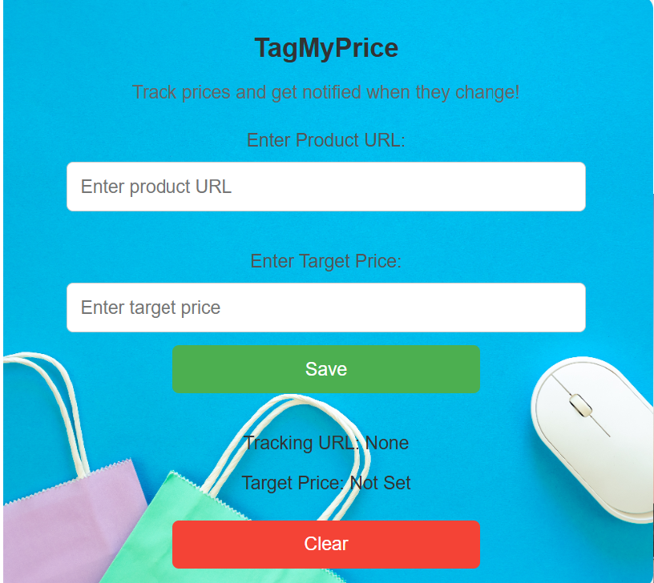

# TagMyPrice
A Chrome extension that tracks product prices on e-commerce websites and notifies you when they drop below your target. Simplify your online shopping experience with real-time alerts!🚀

---

## **Features**
- 🛒 **Track Product Prices**: Add a product URL and a target price to start tracking.
- 🔔 **Price Drop Notifications**: Get notified when the product price drops below your target.
- 💾 **Data Persistence**: Saves your tracking preferences locally in the browser.
- 🎨 **User-Friendly Interface**: Clean and intuitive popup design with input fields and clear instructions.

---

## **Screenshots**
### **Popup Interface**


---

## **How to Use**
1. **Install the Extension**  
   Download the repository and load it into Chrome as an unpacked extension:
   - Go to `chrome://extensions/` in Chrome.
   - Enable **Developer Mode** (toggle in the top-right corner).
   - Click **Load Unpacked** and select the folder containing the extension files.

2. **Track a Product**  
   - Click the extension icon in your browser.
   - Enter the **product URL** in the input field.
   - Set your **target price** and click "Save."
   - The extension will start monitoring the price.

3. **Notifications**  
   - If the product price drops below your target, you'll receive a browser notification.

4. **Clear Tracking**  
   - Click the "Clear" button to remove your saved tracking details.

---

## **Development Setup**

1. Clone the repository:
   ```bash
   git clone https://github.com/your-username/price-lock-notify.git
   cd price-lock-notify
   ```

2. Open the project in your code editor (e.g., VS Code).

3. Load the extension in Chrome as described in **How to Use**.

4. Make changes and reload the extension in Chrome to test.

---

## **Technologies Used**
- **HTML**: Popup and UI structure.
- **CSS**: Styling for a clean, user-friendly design.
- **JavaScript**: Core functionality for tracking prices and storing data.
- **Chrome APIs**: For browser notifications and storage.

---

## **Project Structure**
```
price-lock-notify/
│
├── manifest.json      # Extension configuration file
├── popup.html         # Popup UI
├── popup.js           # Handles popup logic
├── content.js         # Scrapes prices from web pages
├── background.js      # Handles notifications
├── styles.css         # Styling for popup UI
├── icon.png           # Extension icon
└── README.md          # Project documentation
```

---

## **Future Enhancements**
- ✨ **Support Multiple Products**: Track prices for multiple URLs.
- 🌐 **Cross-Site Support**: Optimize scraping for more e-commerce platforms.
- 📈 **Price History**: Display a graph of price trends.
- 🔗 **Social Sharing**: Share your tracked deals with friends.

---

## **Contributing**
Contributions are welcome!  
1. Fork the repository.
2. Create a new branch:
   ```bash
   git checkout -b feature/your-feature
   ```
3. Commit your changes and push:
   ```bash
   git commit -m "Add your feature description"
   git push origin feature/your-feature
   ```
4. Open a pull request.

---

## **Acknowledgements**
- Inspired by the need for smarter shopping tools.
- Special thanks to the contributors and Chrome extension developers for their amazing documentation.

---

